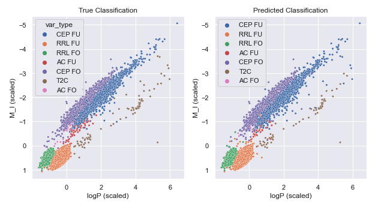

# Machine-Learning-Projects
Testing lab for some machine learning applications

## Variable Classification 

I have used both the K Nearest Neighbors, and a Linear SVC methods to classify pulsating stars into their subgroups. 
The training dataset is the OGLE IV Catalog of Variable Stars, with some additional cleaning. Below is a quick summary of the results. 

| Class  | precision | recall | f1-score | 
| ------ | --------- | ------ | -------- | 
| AC FO  | 0.22      | 0.09   | 0.13     |
| AC FU  | 0.67      | 0.10   | 0.18     |
| CEP FO | 0.97      | 0.99   | 0.98     |
| CEP FU | 0.97      | 0.99   | 0.98     |
| RRL FO | 0.99      | 1.00   | 0.99     |
| RRL FU | 1.00      | 1.00   | 1.00     |
| T2C    | 0.95      | 0.88   | 0.91     |
